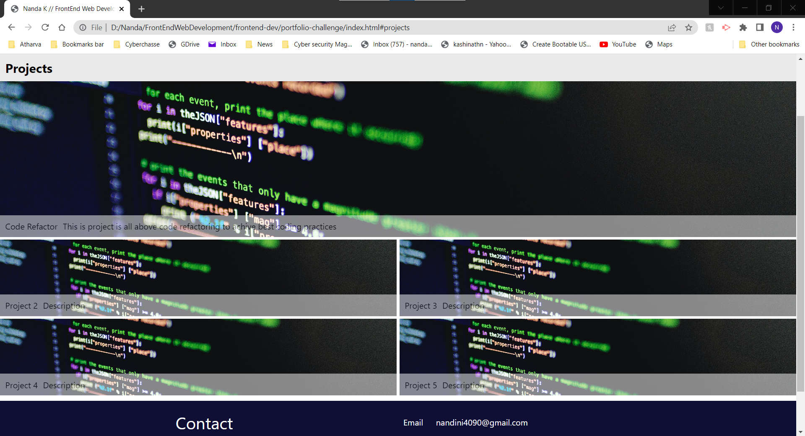
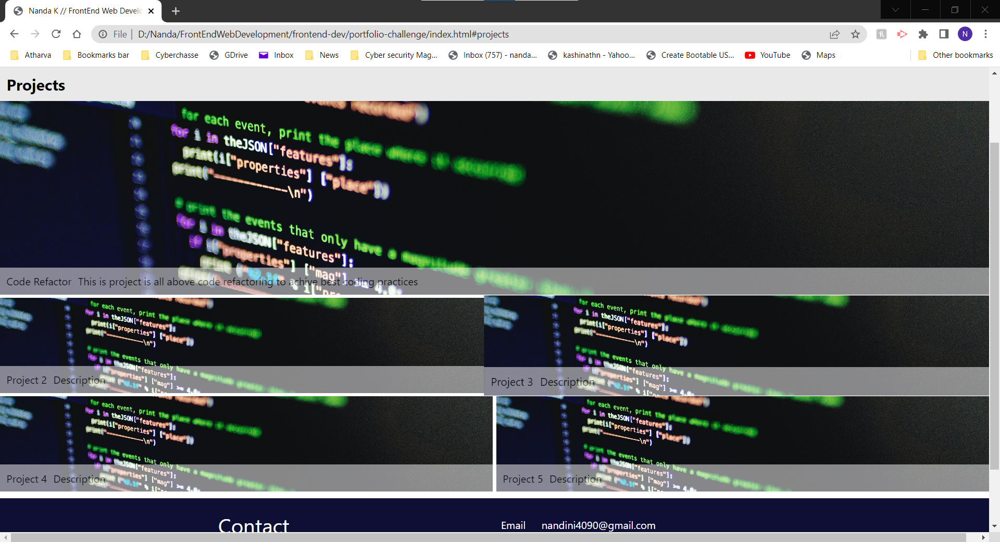
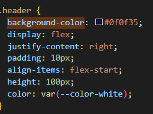
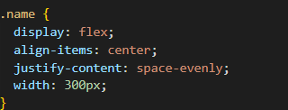
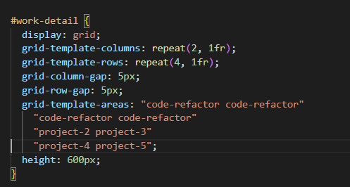

# Portfolio

## Description

Following points shows that the portfolio that I developed satisfies typical hiring managers's needs.

* When portfolio website is loaded,page shows my name, avatar, links to my projects and my contact details.

* When one of the links in navigation bar clicked UI scrolls to the corresonding section.
Here I clicked on projetcts links it scrolls to Projects section.

* When viewing section of my work,it shows titled image of my application.
Here I have uploaded my previous challenge as one of my projects.
Here you can see my first project Code Refactor.

* When project image is presented,application's image gets larger than other projects.

* When image of my first project Code Refactor are clicked, it takes to the deployed application.

* When page is resized or viewed on various screens and devices then layout is responsive and adapts to my viewport.

## Properties that are covered

* Used flex box properties in my portfolio-challenge.

* Used grid property in my portfolio-challenge.

* Used CSS variables in my portfolio

### The URL of the deployed application
https://nandanippani.github.io/frontend-dev/portfolio-challenge/ 

### The URL of the GitHub repository that contains my code
https://github.com/Nandanippani/frontend-dev/tree/main/portfolio-challenge

## Installation

N/A

## Usage

This is my portfolio web site used to show my work. 
This gives brief description about each project.

## Credits

N/A

## License

Please refer to the LICENSE in the repo.

